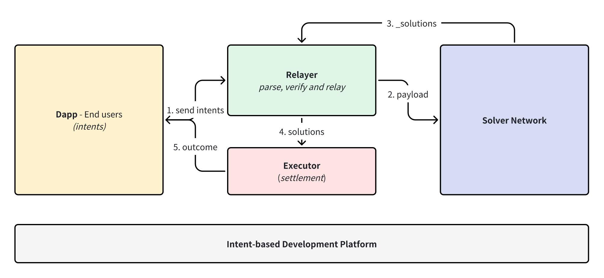
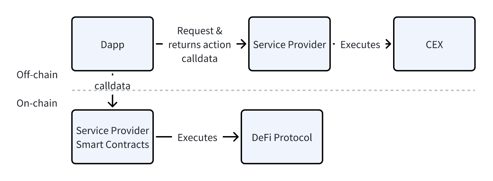

- [Torus Network (intent-centric)](#torus-network--intent-centric-)
  * [Intent](#intent)
  * [Intent重塑交易订单流](#intent-------)
  * [Torus: Intent-centric protocol / Infra](#torus--intent-centric-protocol---infra)
    + [产品特性设定](#------)
    + [Intent Expression](#intent-expression)
      - [Intent types](#intent-types)
      - [Intents DSL](#intents-dsl)
      - [MVC model](#mvc-model)
    + [`Li` Service Provider](#-li--service-provider)
    + [Solver Network](#solver-network)
      - [Solver Candidate](#solver-candidate)
  * [意图协议案例分析](#--------)

# Torus Network (intent-centric)
> 本项目探讨一种基于意图的全新dapp开发模式，通过intent-based protocol&solver network来实现对区块链操作复杂度的封装，提高开发效率及web3开发普适度。该模式可广泛用于通用dapp开发、交易机器人等应用。- @nicholaslico

## Intent
意图的定义很多，总体来看意图就是一种声明式范式，表达了用户需求的操作过程和最终结果。用户在提出自己的意图后，经过一系列操作得到了结果，代理用户完成这些步骤的主体则是“以意图为中心”的协议/应用，在此过程中由解决者理解意图并提出解决方案（执行路径）。广义上的意图概念可指理解用户需求并代理完成所需操作，实现最终结果（outcome）。

## Intent重塑交易订单流
在传统区块链交易订单流状态下，用户想要实现多项关联交易或某种策略，必须自己掌握必要知识并导航执行路径，从而形成交易订单流。我们设想未来 web3 生态系统采用以意图为中心的方法，在这个新范式中，用户可以自由表达他们的意图，意图的订单流会变得更加复杂，同时用户可将复杂性委托给Solver.

在这种情况下，不同类型的意图可能由特定的平台或协议提供服务。例如，swap意图可以由Cowswap，UniswapX处理；钱包相关功能的意图可以由帐户抽象（AA）钱包来处理；像 SUAVE 和 Anoma 这样的平台可能会解决更通用和多领域的意图。

由此可以看出，意图的订单流可以使用更复杂的路径和不同的解决方案提供商。以意图为中心，新的交易订单的供应链产业开始产生。以下是可能的一种订单流：

1. *Intent expression and auth* 用户表达意图，并授权
    - 通过意图声明式语言，意图可被充分表达，普通用户可能需要帮助将他们的意图转化为代码。这可以通过dapps/钱包通过提供用户友好的界面来实现（低代码/拖拉拽），或者某种聚合器提供一个通用界面来表达任何意图，如借助GPT。
2. 发送意图到临时存储(比如mempool)
    - 主要分为需要许可和无许可的内存池。基于意图的应用程序不仅涉及与智能合约交互的新消息格式，还涉及替代内存池形式的传播和交易对手发现机制。设计一种既兼容激励又不中心化的意图发现和匹配机制并非易事，另行讨论。
3. *Solving* 解决者提出解决方案并竞争意图订单
    - 这里涉及不同协议对解决者的不同要求，有些协议要求解决者同时具备求解能力和建块能力（如SUAVE）。因为有些意图涉及通过构建区块来解决跨链任务，例如跨链MEV操作。熟练的区块构建者在构建有价值的区块和更快地完成任务方面具有优势。
    - 有些意图可能主要需要算法专业知识，例如优化跨多个链的流动性聚合。这些意图可能依赖于特定类型的solver.
4. *Settlement and validation* 结算并验证意图交易完成
    - 目前存在各种验证办法，每种都有自己的权衡。使用智能合约进行验证虽然可靠，但通常缺乏可扩展性，因为不同的意图需要特定的验证逻辑和代码。 
    - 依靠预言机进行验证会带来与预言机相关的风险，但提供了与多个链无缝集成的优势。 
    - 如原生意图基础设施Anoma VM 需要意图应用程序采用 Anoma 框架，提供验证各种意图的功能。 

总之，在以意图为中心的世界中，订单流与以交易为中心的世界不同：
- 用户签署并授权交易 vs 用户有更多选择来表达自己的意图。
- 存在用于不同目的的单个内存池与多个内存池。
- Dapps 负责执行 vs 一个称为解决者选择加入的新角色，并竞争解决问题。
- 不同链分别结算 vs 多个链可以一起结算（新型跨域执行）

## Torus: Intent-centric protocol / Infra

该开发平台核心是以意图为中心的协议，<ins>它构建了一个无许可或有许可的解决者网络，解决者竞争提出最佳解决方案并通过协议验证和结算。它通过一种对区块链操作的领域特定语言面向开发者，能与智能合约配合实现一切需求，与前端技术一起可完备开发dapp。</ins>


_基于意图开发平台架构(decentralized)_

我们将协议方案分为5个主要部分和主要问题，
1. 意图表达，用户如何输入意图；用户可以表达什么类型或范围的意图；用户授权如何进行？
2. 解决者准入，是需要许可的还是无需许可的？成为解决者的准入条件？解决者的不同专业类型？
3. 解决过程，解决方案的主要路径是什么？如何评估解决方案的有效性？
4. 解决者选择，多个解决者竞争的获胜规则是什么？
5. 验证和结算，如何检查解决者是否完成了任务，如何结算？

### 产品特性设定
| | | |
|:---|:---|:---|
| Intent expression and auth |<ins>*Intent type*</ins>| Any intents that can be written in DSL, omnichain enabled.|
| |<ins>*Interaction*</ins>| Intent-based dapp, intents DSL |
|Solver candidate| <ins>*Entry criteria*</ins> |  Gated or Permissionless |
|Solving| <ins>*Solving process*</ins> | ... ; Simulate offchian, build bundles, propose bundles to the destined chain / omnichain |
|Solver competition| <ins>*Orderflow auctions*</ins> | Orderflow auctions - Transaction execution service|
| | <ins>*Bid selection*</ins> | Max user cashback, winner-takes-all |
| Settlement and validation | <ins>*How to validate?*</ins>| A smart contract checks the validity|
| | <ins>*Settlement system*</ins> | Settle on omnichain through protocol, release by smart contract |

### Intent Expression
> " tell me what to do, or tell me what you want."

#### Intent types
> limit order是最常见的一种intents.

- **Conditional Intents**: Allow an action when one or more conditions are met
- **Continuous Intents**: Express a desire to take a repeated action
- **Multi-Step Intents**: When one intent is solved, this opens one or more new intents
- **Intent Graphs**: The pathways formed by a group of related intent


**Conditional Intents**

条件意图在满足一个或多个条件时执行某个操作。以下是一些例子：

- 价格阈值：“如果 A/B 价格下跌到 X 以下，将 B 换成 A”。在传统金融中，这被称为“止损”。
- 治理决策：“如果我不支持的治理提案通过，卖掉代币 A”。
- 钱包余额：“如果我的热钱包的 ETH 不足，从我的冷钱包转移更多 ETH 到我的热钱包”。
- 时间/区块：“如果已经挖掘了超过 X 个区块，将 ETH 转移到一个接收者地址”。

所有这些都可以作为单个意图进行签署。一旦条件满足，solver将监视这些意图并代表用户采取行动。如果用户将这些条件作为意图的一部分进行签署，solver将通过某种链上状态检查来证明条件。


**Continuous Intents**

连续意图表达了对重复性操作的需求。用户今天通过将资金存入协议来进行连续操作，定投、收益复利和做市是典型的例子：

- 定投：“每个月以市场价格用 DAI 购买 ETH”。
- 收益复利（Restaking）：“提取代币 A 的奖励，换成代币 B，并重新质押”。这是一个繁琐的过程，涉及多个交易和与多个 DeFi 协议的交互。
- 做市：基于 AMM 的 LP 仓位基本上遵循两个反向交换的无限循环模式：“如果 A/B 的价格超过 X，将 A 换成 B；如果 A/B 的价格低于 X，将 B 换成 A”。

从这些例子中可以看出，当前的连续操作需要用户将资金存入特定的协议并提交许多交易。有了意图，用户可以通过单个签名来表达他们期望的连续操作。


**Multi-Step Intents**

一个意图解决后，打开一个或多个新的意图。意图可以由多个步骤组成。可以将这些意图视为状态机，其中每个交易从前一个状态过渡到新状态。我们过渡到的新状态取决于前一个状态定义的条件。

**Intent Graphs**

即可组合意图，由一组相关意图形成的路径。

#### Intents DSL
> [Li-language]('https://github.com/0xnicholas/torus/li-language/README.md')

设计一种声明式语言`Li`来进行意图表达，这类基于意图的领域特定语言一般具有以下特性：

- 用于定义状态机的结构化语言
- 有条件，可组合的执行
- 可在L语言中调用应用和服务，例如DeFi协议
- 声明式范式，以结果产出代替执行路径

语言设计示例（*JSON-based or SQL-like*）

**JSO-based**

在此类设计下，意图被看做是一种状态机，并表达为基于JSON的DSL，用于描述该状态机。意图状态机是面向开发者设计的，可由Solver解释执行，若必要Solver还可以对该意图状态进行优化修改，最大收益实现用户意图。

> 例：stop-limit order: “If the price hits X, place an order to buy/sell at Y.”

```JSON
{
    "begin": "limitPrice",
    "limitPirce": {
        "type": "choice",
        "choices": [
            {
                "var": "$.marketPrice",
                "numericEquals": 2100,
                "next": "sellLimit"
            },
            {
                "var": "$.marketPrice",
                "numericLessThan": 2100,
                "next": "buyLimit"
            }
        ]
    },
    
    "sellLimit": {
        "type": "swap",
        "tokenIn": "WETH",
        "tokenOut": "DAI",
        "tokenInAmount": 10,
        "fee": 2.5
    },
    
    "buyLimit": {
        "type": "swap",
        "tokenIn": "DAI",
        "tokenOut": "WETH",
        "tokenInAmount": 10,
        "fee": 2.5
    }
}
```

**SQL-like**

SQL-like的`Li`语言主要由define, manipulate, control和query构成.

```SQL
/* define */
DEFINE INTENT intent1(IN , OUT, INOUT)
BEGIN
DEFINE TRANSACTION tx1 (type: "swap", tokenIn: "DAI", tokenOut: "ETH", tokenInAmount: $.amount, fee: $.fee)  -- or JSON params
COMMENT "no comment"
SIGNED BY "0x...";
STATE "pending"   /* timeout, succeed, fail */
CHAIN "ethereum"  /* or "ETH" */

/* conditional execution */
IF ($.sigPrice <= $.marketPrice) THEN
    PASS;
ELSE
    ALTER TRANSACTION tx1 SET tokenInAmount = $.amount2; /* 写法1 */
    ALTER TRANSACTION tx1 (tokenInAmount: $.amount2); /* 写法2 */
END IF;

SEND tx1;
END;

/*---------*/
USE CHAIN ethereum  /* or USE CHAIN ETH */
OP
MSG
CALL INTENT

/*---omnichain query---*/
SHOW INTENT STATUS [LIKE 'pattern' | where expr];
SHOW INTENT intent1 STATUS;
SHOW INTENT STATUS;
SHOW TRANSACTION tx1 [LIKE 'pattern' | where expr];
```

#### MVC model
`Li`语言能进行全链操作，进行有条件、可组合意图以及调用自定义服务（如DeFi协议，API等）。这时我们发现一种基于意图的经典MVC开发模式变得可能，由此开发dapp的结构变得十分简洁。


[表现层] user interface (react hooks)   [意图控制层] 意图逻辑  [区块链抽象层] 交易操作


### Toru Service Provider
> `Li` backed的服务层, 可视为独立产品 详见[torus-service](https://github.com/0xnicholas/torus-service)

[Torus Service](https://github.com/0xnicholas/torus-service) 提供用于与区块链生态进行交互的统一API。Dapp与每个链/协议/dapp进行交互既耗时, 成本高昂且容易出错。`Service Provider` API允许开发人员构建一次并与所有产品集成。（灵感来源- MuleSoft from Salesforce）



### Solver Network
> Solver是进行意图实现的一类开发者bots

#### Solver Candidate

**Solver竞争 & 订单流拍卖(OFA)**

准入机制最常用的一种方式就是白名单，这有助于降低抢先交易的风险，同时仍保持一定程度的解决者竞争。但显然它依赖于一定程度的中心化治理。
在无许可方案上，常见的机制类似PoS，即解决者进行一定金额的质押即可开展订单竞争。因为无许可，这带来了一系列复杂的竞争机制。

在完全中心化的系统中，可以轻易实现有序交易，单个获得许可的解决者可以选择利用自己的位置来获取更多利润，没有进行竞争的解决者不必考虑任何交易失败的风险或抢先交易的可能性。 
在一个完全开放且无需许可的系统中，利润率被推向零，用户将受益于更高效的路由，但他们也必须间接支付与求解器需要考虑的碰撞和抢先交易风险相关的任何成本。

由于所有求解器成本最终都会转嫁给用户，因此以意图为中心的协议应该理想地帮助求解器降低成本。 对于解决者来说，成本最高的两个风险是交易冲突(transaction collisions)和抢先交易(front-running)。 以意图为中心的协议可以通过一种Solver协调方法(forcing solver coordination)来减轻这两种风险。

有几种不同的方法来强制求解器协调，例如Round-robin Selection、白名单和订单流拍卖（OFA）。
> 这里只重点讨论OFA

**OFA**

[torus-OFA]


**解决过程(提出解决方案)**

[torus-solver-template] [build a solver]


**结算和验证**

[torus-contracts] [validation] [settlement]

---

## 意图协议案例分析

- Cow Swap & 1inch fusion（limit order intent）
- UniswapX (Swap intents)
- AA (Wallet-level intents)
- Essential (Intent-centric AA standard)
- Flashbots SUAVE (Multi-chain Block-related Intent)
- Anoma (Generalized Intent for Anoma Protocols)

**CoW Swap & 1inch fusion（limit order intent）**

- 意图表达和授权： 
  - Cow Swap 和 1inch Fusion 平台上的交易者通过与平台界面交互来表达他们的意图，为所需交易或限价订单提供明确的指令。 
  - 在授权方面，交易者签署链下消息或交易来授予许可。他们用交易的代币而不是 ETH 来支付 Gas 费，如果交易不执行，他们也无需支付任何费用。
- 求解器候选者：
  - 对于 1inch Fusion，解算器（称为解析器）以许可的方式运行。他们需要注册、接受 KYC 流程并保持足够的余额来支付订单费用。 
  - 另一方面，Cow Swap 的求解器要么通过创建 100 万美元（USDC & COW）的绑定池列入白名单，要么包含在 CoW DAO 绑定池或 Gnosis DAO 绑定池中，并根据 DAO 的标准被 Cow DAO 列入白名单。标准。
- 解法： 
  -  求解器评估现有批次，以确定任何需求重合 (CoW)，从而为执行交易或限价订单提供最佳价格。他们考虑流动性、订单深度和价格滑点等各种因素，以确保交易者获得最佳执行。 
  - 此外，解决者可以直接探索其他底层链上自动做市商（AMM），例如 Uniswap，或利用 1inch 等 DEX 聚合器来找到最优惠的价格和路线。
- 求解器选择： 
  - 在 Cow Swap 中，交易者使用批量拍卖以任何外部求解器确定的最佳价格执行，从而最大化交易者盈余。选择提供最佳解决方案的求解器。
  - 相比之下，1inch Fusion 中的解析器竞争受到更多限制，并且与使用荷兰式拍卖质押的 1inch 代币相关。
- 验证与结算： 
  - 验证和结算过程发生在求解器执行交易或限价订单之后。解决者可以利用授予结算合约的 ERC20 批准代表用户转移代币。结算合约验证用户意图的签名，并确保执行符合指定的限价和数量（由 EIP-1271 启用）。此验证确认已成功完成预期交易或限价订单。
  - 一旦验证，结算合约有助于将资金适当分配给参与交易的解决者和用户。

**UniswapX (Swap intents)**

UniswapX的新功能可以分为2个主要部分： 
- 通过荷兰式拍卖机制签署订单 
- 跨链互换
荷兰式拍卖的签约订单与 1inch Fusion 和 Cow Swap 的限价订单意图类似，但有以下区别：
- 意图表达和授权：用户有更多的自由度（也可能带来更多的复杂性）来定义参数，包括拍卖的衰减函数、初始荷兰订单价格等。
- Solver Candidates：permissionless而不是permissioned（也可以设置为用户许可）； 
- 求解器选择： 
  - 荷兰订单的执行价格取决于其包含在区块中的时间。对于交换者来说，订单的起始价格估计比当前市场价格更好——例如，如果当前市场价格为每 ETH 1,000 USDC，则卖出订单的起始价格可能为每 ETH 1,050 USDC。然后订单的价格会下降，直到达到交换者可以接受的最差价格（例如 995 USDC/ETH）。一旦对订单有利可图，填充者就会被激励去填充订单。如果他们等待太久，他们就有可能将订单拱手让给愿意获取较小利润的另一个填充者。
  - UniswapX 还可以将 RFQ（允许订单指定一个填充者，该填充者在短时间内获得填充订单的专有权利）纳入初始荷兰价格设置，在这种情况下，选择过程几乎与 1inch Fusion 的拍卖方法相同。
  - 与 UniswapX 和 1inch 的独立拍卖相比，Cow Swap 更像是批量拍卖，可以合并订单并匹配 CoW。
- 求解过程和验证结算 与Cow Swap和1inch类似

跨链互换可以通过类似的流程来实现，主要区别在于验证和结算以实现多域互换：
- 求解者需要在原链上存入更多的债券资产，以确保安全并启用乐观的跨链协议
- 需要额外的结算预言机来输入源链的验证合约
- 需要UniswapX在不同域部署相应的结算和验证合约

**AA (Wallet-level intents)**
- 意图表达和授权： 
  - 当钱包所有者想要执行特定操作时，意图表达和授权的过程就开始了。他们通常通过 4337 钱包界面制作用户操作来表达他们的意图。 
  - 在链下，钱包所有者请求捆绑器代表他们处理用户操作，根据意图授权有限的控制。例如，钱包所有者可能会授权私钥能够从您的主账户进行交易，但只能与 Dapp XYZ 的中心合约进行交易。
- 求解器候选者：
  - Bundler 服务在 AA 框架中被视为公共产品。大多数捆绑器都是开源的，这使得它们不具有排他性和非竞争性。任何 RPC 端点都可以复制开源代码并作为 Bundler 运行。即使 Bundler RPC 端点对其服务收费，它也可以通过 API 密钥来实现，同时仍然保持 Bundler 作为公共物品的非排他性。
  - 捆绑器的两种主要类型：专为钱包构建的捆绑器服务，满足其基本需求以及旨在构建无需许可和模块化捆绑器的第三方基础设施提供商 
- 解法： 
  - Bundlers 在 userop 上模拟钱包的 validateOp 方法，以确定是否在链下接受或拒绝它。然后，他们将交易发送到AA系统的入口点以调用handleOp方法。此过程还涉及将多个用户操作捆绑在一起以优化气体并提取 MEV。 
  - 入口点合约将操作推送到链上，链节点将验证操作并使其达成共识。
- 求解器选择： 
  - AA 中求解器的选择取决于多种因素。账户所有者使用的钱包可能提供捆绑器服务或使用第三方基础设施，用户也可能切换 rpc 端点来选择喜欢的捆绑器，在这种情况下，捆绑器的成功率和声誉可能会影响他们的选择。 
- 验证与结算： 
  - AA系统的入口点在链上验证并结算操作。它确保用户操作在执行所需操作之前满足要求和安全检查。一旦操作成功执行，入口点就会从钱包存入的资金中将 ETH 退还给捆绑器。这种退款机制补偿了捆绑商的工作和预付款。

**Essential (Intent-centric AA standard)**

要点：短期内，它将是一个基于资产的意图标准（类似于erc-4337模型，但支持更通用的意图），并具有一组便利的基础设施。从长远来看，它还将提供模块化意图层和新的基于约束的语言，摆脱以太坊架构的限制并提供更好的意图执行。
- 意图表达和授权： 
  - 采用 Essential 标准的 Dapp 或钱包可以为用户提供相关的基于意图的服务，并消除潜在的复杂性。用户只需与界面进行交互并进行授权即可。
  - 意图可以用ST的Essential标准来表达，更普遍的是使用其 新的基于约束的语言用LT来表达。 
  - 兼容EVM链，无需桥接资金
- 求解器候选者：
  - Essential 使代码能够表达意图；各种类型的求解器都可以加入Essential网络来解决相应类型的意图，例如用于交换意图的Cow Swap求解器或用于监视和执行链状态相关意图的构建器。
  - 解决者网络将监控意图并尝试实现它们。Essentials 正在考虑现有的求解器/捆绑器（例如，来自 CoW 协议或 4337）、当前的 MEV 搜索者和做市商。
- 解法： 
  - 求解器找出他们正在解决的约束环境，然后使用链下和链上场所来尝试解决这些基于约束的意图
- 求解器选择： 
  - 选择过程更像是荷兰式拍卖，其中用户指定约束，而求解器根据可以从满意度中提取的价值来决定何时介入以满足意图。第一个介入并解决意图的解决方案将是选定的解决方案，并且可能是市场当时可以承受的最佳解决方案。
- 验证与结算： 
  - 验证和结算都是由求解器触发特定的链上智能合约来验证和分割付款而发生的。将有一个核心合同，所有解决方案以及所有意图和解决方案都将提交到该合同中，并且可以根据基本标准进行扩展。 

**Flashbots SUAVE (Multi-chain Block-related Intent)**

与前面示例中通过智能合约进行意图结算相比，SUAVE 采用了一种专门的方法，利用专用链进行结算，该链也充当消息传递层。
与账户抽象 (AA) 和特定意图的应用程序相比，SUAVE 引入了将资金桥接至 SUAVE 链的额外步骤。这一步骤主要是由 SUAVE 的多链功能以及对更具成本效益、支持隐私的交易的渴望推动的。 
SUAVE 刚刚宣布推出 MEVM，这是对 EVM 的强大修改，并为 MEV 用例提供了新的预编译。借助 MEVM，SUAVE 链将首先有效地服务 MEV 相关参与者，例如搜索者、构建者和其他想要捕获 MEV 的领域。
- 意图表达和授权： 
  - SUAVE 用户通过编写 EVM 代码在 SUAVE 中表达他们的意图。这些代码通过定义允许访问用户机密数据的合同列表来概述他们希望执行的期望结果和功能。可能有一些适合普通用户的可用模板。
  - 通过MEVM，开发者可以为特定的MEV应用（例如OFA、区块构建等）部署不同类型的智能合约，或者在SUAVE上部署新型DEX以供其他用户调用。
  - 用户将资金桥接至 SUAVE 链并存入小费。
- 求解器候选者：
  - SUAVE 中充当求解器的主要参与者可能是搜索者和构建者。搜索者和其他解决者负责探索和发现潜在的解决方案来满足用户意图，而构建者则专注于实施这些解决方案。他们共同形成一个强大的生态系统，解决用户表达的意图。
  - 为了实现不同领域的块相关意图，可能存在不同领域的多种类型的求解器来支持不同的VM。
- 解法： 
  - 求解器进行可信且私密的链下计算，这些计算可通过 TEE 环境中的特殊预编译用于 SUAVE 上的智能合约。
  - 求解器共同构建包含一系列意图的构建块。区块构建的目的是将意图聚合并组织成可以向网络提议的有价值的区块。
- 求解器选择： 
  - 在 SUAVE 中，求解器的选择遵循两种主要方法。首先，通常会选择首先完成预期任务的求解器。这提高了交付解决方案的效率和及时性。或者，可以实施订单流拍卖机制，其中解决者向用户出价，将部分订单流价值返回给用户。
- 验证与结算： 
  - 为了确保意图的有效性和结算交易，SUAVE 使用预言机和 SUAVE 验证器。预言机提供外部数据来验证意图的执行，而 SUAVE 验证器则在 SUAVE 链上验证和结算意图。 

**Anoma (Generalized Intent for Anoma Protocols)**

Anoma是一个类似于Cosmos的通用架构，并准备推出支持IBC的第一层权益证明（PoS）链。它将以意图为中心的设计与由 Anoma 虚拟机 (VM) 提供支持的同构协议相结合，同时还提供异构安全功能（不同的 Anoma 协议具有不同的共识机制）。
- 意图表达和授权： 
  - 用户通过与 Anoma DApp 交互来表达定义最终状态或其应具有的属性的意图。
- 求解器候选者：
  - Anoma 欢迎各种各样的求解器，每个求解器专门针对不同类型的应用程序。这些求解器监控符合其兴趣和目标的内存池。根据他们的具体关注点，他们观察所有意图或意图的子集。 
- 解法： 
  - 求解器运行求解器算法，利用其在同质代币 (FT) 交易或计算汇总状态等领域的专业知识。 
  - 匹配意图也由求解器负责。求解器获取意图并进行部分或完全匹配的交易。求解器决定匹配什么/何时、部分求解收费多少以及如何处理剩余。
  - 一旦求解器形成完全平衡的交易，他们就会将其提交到属于 Anoma 生态系统一部分的内存池节点。
- 求解器选择： 
  - 选择可能会受到求解器高效、及时地完成任务的能力的影响，遵循先来先服务的方法，即选择第一个完成任务的求解器。
- 验证与结算： 
  - 来自不同Anoma协议的验证者运行Anoma Vm来完成意图的执行和验证。Anoma VM 通过检查所有相关的有效性谓词（声明性智能合约）是否得到满足来确保意图执行的完整性和有效性。
  - 向解决者分配资金和奖励是基于 Anoma VM 意图的执行和验证。